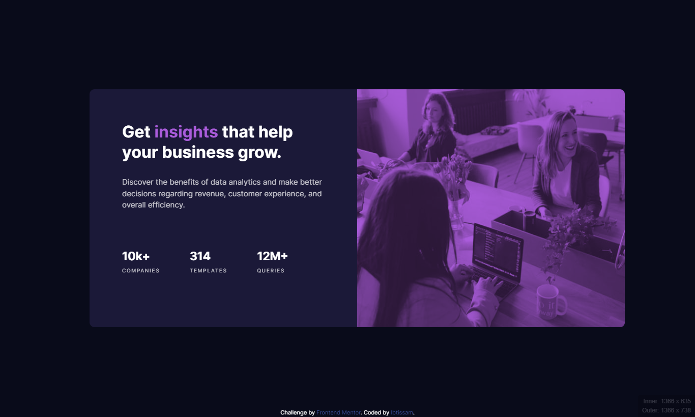

<h1 align= "center">Intro component with sign up form solution</h1>

  <h3>
    <a href="https://serene-bavarois-ae799a.netlify.app/">
      Demo
    </a>
     | 
    <a href="https://www.frontendmentor.io/challenges/stats-preview-card-component-8JqbgoU62">
      Challenge
    </a>
  </h3>

## Table of contents

- [Overview](#overview)
  - [About the Project](#About-the-Project)
- [My process](#my-process)
  - [Built with](#built-with)
  - [What I Learned](#what-I-learned)
  - [Useful resources](#Useful-resources)
- [Acknowledgments](#acknowledgments)

## Overview

### About the Project

Another Perfect Project for newbies to focus on your HTML & CSS, The main challenge is to build out this card component and get it looking as close to the design as possible.

You can use any tools you like to help you complete the challenge. So if you've got something you'd like to practice, feel free to give it a go.

Your users should be able to:

View the optimal layout depending on their device's screen size

## My process

### Built with

- Semantic HTML5 markup
- CSS custom properties
- Flexbox
- Mobile-first workflow

**Note: I do not have access to the Figma sketch so the design is not pixel perfect.**

### What I Learned

It wasn't a hard challenge, however, I've struggled a lot to make the image overlay color looks like in the design given, I tried to make an overlay with position absolute and given it an opacity but it doesn't work, I searched and finally, I found that I can make it with <b>Mix-blend-mode</b> property which I didn't know about it before, with an opacity of 75% to give me the same darkness of the color that exists in the design. 

### Useful resources

- <a href="https://www.figma.com/">Figma</a>: Copy and paste your images Design to help you check the width and height of your containers, images etc ...

- <a href="https://chrome.google.com/webstore/detail/perfectpixel-by-welldonec/dkaagdgjmgdmbnecmcefdhjekcoceebi">Pixel Perfect</a>: Awesome Chrome extension that helps you to match the pixels of the provided design.

- <a href="https://www.youtube.com/watch?v=TAA89nkEuhw">How to use mix-blend-mode, and how to avoid problems with it</a>: A great explanation from Kevin Powel about the mix-blend-mode.

## Acknowledgments

A big thank you to anyone providing feedback on my solution. It helps to find new ways to code and find easier solutions!